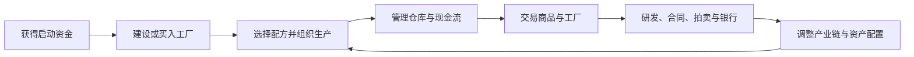

# Economy

<div align="center">
  

  <p><strong>网页端多人在线经济模拟、产业经营与市场交易游戏。</strong></p>
  <p>从启动资金开始，建设工厂、组织产业链，在持续演化的多人经济中配置资产、竞争与合作。</p>

  <p>
    <a href="https://game.riversoft.top/economy/"><strong>开始游戏</strong></a>
    ·
    <a href="https://game.riversoft.top/economy/admin">管理员页面</a>
    ·
    <a href="docs/README.md">设计文档</a>
  </p>
</div>

<p align="center">
  <a href="https://github.com/RIVERS0FT/Economy/actions/workflows/ci.yml">
    
  </a>
  
  
  
</p>

## 项目简介

Economy 是一款以生产、交易和资产配置为核心的多人在线经济模拟游戏。玩家从首次建档启动资金出发，在美国本土连续 48 州切换经营位置，建设或买入当地工厂，选择生产配方，管理本地无限仓库与现金流，并在州级本地市场中交易商品和工厂资产。

市场价格由玩家订单、生产活动、消费需求和市场储备共同影响。玩家还可以通过产业研发、长期供货、玩家抵押借贷、工厂租赁、银行存贷款和资产包拍卖扩展经营策略，持续提升净资产与排行榜名次。

游戏中的普通货币、宝石、商品、工厂、积分和价格均为虚构内容，不对应真实货币、证券或商品。

## 核心特色

- **产业链经营**：建设工厂、选择配方、配置作业制度，并根据原料、产能和利润调整生产结构；C1/C2 使用与真实产业投入联动的工厂专属制度。
- **美国本土州级经营地图**：连续 48 州均可点击；地图作为玩家页面常驻战略底层，提供州界、资产、工业、市场和异常镜头；每个州拥有独立商品库存、工厂集群、商品行情和工厂行情，跨州订单不会撮合。
- **本地统一资产市场**：同一州级地区的商品与工厂使用统一限价订单体系，支持真实冻结、撮合、成交和估值。
- **地区化工厂权利**：银行抵押、玩家借贷抵押和工厂租赁都绑定工厂所在地区；同类型工厂不会跨省被锁定、处置或转移使用权。
- **动态经济环境**：工厂承载与运行状况推动人口迁入迁出，人口收入、消费需求、市场储备和产业链价格传导共同形成持续变化的供需关系。
- **合同与拍卖**：发布和承接供应／采购、放贷／贷款、出租／租赁合同；商品采购／供应合同可留空总批次形成长期合同，仍按批次托管并可在当前批完成后正常结束；固定批次供货合同续签由采购方与供应方分别明确同意，单方同意不冻结续签资产；也可通过资产包拍卖完成更复杂的资产流转。
- **银行与研发**：管理存款、贷款、抵押和周期结算，并通过树状产业技术路线分别研发生产科技与作业科技：生产科技负责制造能力，作业科技负责使用工具、化肥、饲料、药剂、工业耗材、机械和拖拉机；当前研发支持 1 宝石减少 30 分钟的服务器权威加速，工厂建设即时完成且不产生施工加速。
- **服务器权威状态**：资金、库存、订单、合同和最终生产结果均由服务器确认；客户端可以计算待结算生产提案，但不能自行修改资产，服务端必须重新验证后才入账。
- **响应式界面**：统一支持桌面端和移动端，并保留 Tauri 桌面应用外壳。

## 玩法循环



## 在线入口

| 入口 | 地址 | 用途 |
|---|---|---|
| 游戏网页 | <https://game.riversoft.top/economy/> | 登录并进入正式游戏 |
| 管理员页面 | <https://game.riversoft.top/economy/admin> | 运营、审计与管理 |
| RIVERSOFT 主页 | <https://riversoft.top/> | 项目主页与统一账号入口 |
| 设计文档 | [docs/README.md](docs/README.md) | 当前业务规则与设计索引 |
| 协作规则 | [AGENTS.md](AGENTS.md) | 仓库修改、验证和交付流程 |

## 技术栈

| 层级 | 技术 |
|---|---|
| Web 客户端 | React 19、TypeScript 7、Vite 8、Tailwind CSS 4 |
| 数据可视化 | Apache ECharts 6 |
| 桌面外壳 | Tauri 2 |
| 游戏服务 | Node.js 24.4.0、服务器权威 HTTP API |
| 数据存储 | SQLite（全局修订 + 分段世界存储 V2） |
| 状态协议 | 客户端状态 39、世界状态 32、州级经济复合键（内部兼容字段仍为 `provinceId`） |
| 测试与验证 | Node.js Test Runner、Playwright、项目专项防回退脚本 |
| 发布与运行 | GitHub Actions、Nginx、systemd |

## 本地开发

### 环境要求

- Node.js 24.4.0
- 与仓库 `package-lock.json` 匹配的 npm
- Chromium 浏览器依赖仅在运行浏览器测试时需要

### 启动前端

```bash
git clone https://github.com/RIVERS0FT/Economy.git
cd Economy
npm ci
npm run dev
```

开发地址：<http://localhost:1420/economy/>

只查看界面、不启动账号服务和游戏服务时，打开免登录游戏模式：<http://localhost:1420/economy/all-pages-preview.html>（也可直接打开 <http://localhost:1420/economy/?preview=game>）。该模式只在 Vite 开发环境启用，使用固定模拟数据加载正式游戏外壳、完整导航和十一个正式玩家页面；页面切换与州级经营位置选择可正常使用，但不会连接账号／游戏服务，不会执行或保存真实经济写操作。

Vite 会将 `/economy-api` 代理到 `127.0.0.1:3001`，并将 `/economy-api/game` 代理到 `127.0.0.1:3002`。只进行界面开发时可以单独启动前端；完整登录、注册、密码重置和游戏流程还需要对应的本地账号服务与 Economy 游戏服务。

### 启动游戏服务

开发环境可以使用本地 SQLite 文件启动 Economy 游戏 API：

```bash
PORT=3002 \
ECONOMY_DB_PATH=./economy.sqlite \
PUBLIC_ORIGIN=http://localhost:1420 \
node server/src/app.js
```

统一账号服务仍需单独运行在 `127.0.0.1:3001`。

## 常用命令

| 命令 | 作用 |
|---|---|
| `npm run dev` | 生成运行时插画缩略图并启动 Vite |
| `npm run typecheck` | 执行 TypeScript 类型检查 |
| `npm run verify:provincial-economy` | 验证美国连续 48 州、本地市场、仓库、工厂和地图边界 |
| `npm run build` | 运行架构验证、服务器测试、类型检查和生产构建 |
| `npm run test:browser` | 执行 Playwright 浏览器回归 |
| `npm run stress:smoke` | 在隔离环境执行短时压力冒烟测试 |
| `npm run preview` | 本地预览生产构建结果 |

首次运行浏览器测试前安装 Chromium：

```bash
npx playwright install --with-deps chromium
npm run test:browser
```

## 项目结构

```text
Economy/
├── src/          # React 客户端、页面、组件、样式与游戏资源
├── server/       # 服务器权威领域逻辑、HTTP API、SQLite 与服务器测试
├── shared/       # 客户端与服务器共享的州目录和生产结算纯函数
├── docs/         # 当前有效的权威设计文档
├── scripts/      # 构建、验证、生成、诊断和部署脚本
├── tests/        # 浏览器回归与压力测试
├── deploy/       # Nginx、systemd 与生产部署配置
├── src-tauri/    # Tauri 桌面应用配置
└── .github/      # CI、部署、诊断和数据库维护工作流
```

## 文档导航

- [产品与玩法设计](docs/PRODUCT_AND_GAMEPLAY_DESIGN.md)
- [产业与生产设计](docs/INDUSTRY_AND_PRODUCTION_DESIGN.md)
- [统一资产订单簿设计](docs/UNIFIED_ASSET_ORDER_BOOK_DESIGN.md)
- [页面内容与导航设计](docs/PAGE_CONTENT_AND_NAVIGATION_DESIGN.md)
- [UI 设计系统](docs/UI_DESIGN_SYSTEM.md)
- [服务器架构与部署设计](docs/SERVER_ARCHITECTURE_AND_DEPLOYMENT_DESIGN.md)

业务规则、当前版本和部署参数只在权威设计文档、实现代码及对应验证脚本中维护；本文件不复制会随产品迭代变化的详细口径。

## 开发与交付

开始修改前，先阅读 [AGENTS.md](AGENTS.md) 和 [docs/README.md](docs/README.md)，再按任务范围核对对应设计、实现、测试和验证脚本。

提交前至少完成与修改直接相关的专项验证。涉及代码时还应执行：

```bash
npm run build
npm run test:browser
```

Pull Request 会触发 [Economy CI](.github/workflows/ci.yml)。修改压缩合并到 `main` 后，[`.github/workflows/deploy.yml`](.github/workflows/deploy.yml) 会重新构建、运行浏览器测试、部署正式环境并执行线上验收。生产部署的 API 发布包除 `server/` 和便携 Node 运行时外，还必须同步仓库根 `shared/` 到 `/var/www/game/shared/`；`server/src/provinces.js` 以 `../../shared/provinces.json` 读取州级目录，因此安装脚本会在重启 systemd 之前确认该运行时共享文件存在。

### 工厂生产懒结算

正式工厂离线生产采用按玩家懒结算。客户端从现有服务器权威状态和响应中的 `serverNow` 计算每个工厂组的最大合法完成周期数，并通过 `POST /api/game/production/settle` 或随普通玩家动作附带 `productionSettlement` 提案。提案只包含周期数，不包含资金、库存、产量或工资增量；服务器以相同闭式公式检查该周期数合法且再增加一个周期已经不合法，验证通过后才在权威事务中修改资产。旧客户端或提案过期时只允许服务端对当前玩家使用同一公式生成兜底提案；到期供货／租赁合同也只结算明确参与者，不执行全玩家工厂扫描。

### 工厂即时建设

工厂即时建成；农场与果园只支付现金，其他工厂支付现金与正式商品材料。缺料且当前卖盘足够时可继续一键从真实统一订单簿 FOK 购齐后建造；卖盘不足时，建设卡允许按本次 1～100 座建造意图一键提交普通商品缺料买单，可成交部分立即成交、剩余数量继续留在统一市场，并在建设卡按单次建造聚类显示与一键取消。取消只撤销剩余买单，已成交材料保留；建造现金不冻结，材料购齐后仍由玩家显式建造，不会建立第二套订单、系统材料商店、自动建造任务或施工任务。工厂施工时间和施工宝石加速已经退役。

### 删除存档

设置页提供一次性自助“删除存档”：服务器先检查贷款、周结算、拍卖出价和履约合同，安全取消开放订单、无出价拍卖及未承接合同，再原子恢复新玩家经济初始状态。账号、原注册时间、宝石、邀请码、签到、礼品兑换、封禁与服务器审计保留；旧 `/api/game/reset` 继续返回 `410 Gone`。

### 玩家头像资源

设置页头像原图只在浏览器本地处理，上传前固定转换为 64×64 WebP（最终不超过 8 KiB）；生产文件位于 `/var/lib/riversoft-economy-avatars`，由 `/economy-avatars/<userId>.webp` 只读提供，不进入 EconomyState 或状态轮询。
